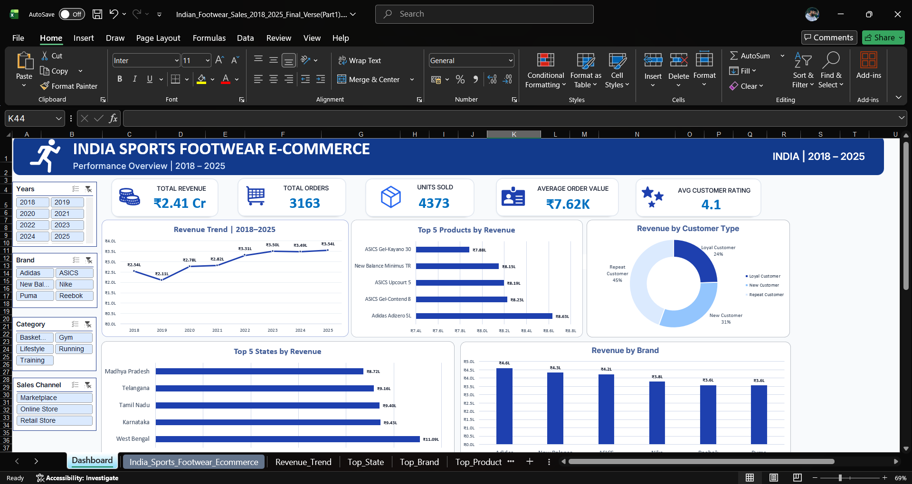

# 🇮🇳 Indian Sports Footwear E-Commerce Sales Analysis

### Interactive Excel Dashboard | Data Analytics Portfolio Project

---

## 📊 Project Overview

This project is an India-focused sports footwear e-commerce sales analysis created using Microsoft Excel.

The project started with a publicly available sports footwear sales dataset. The data was cleaned, transformed and adapted into an India-focused business scenario for analytical and portfolio purposes.

The final output is an interactive Excel dashboard designed to provide a quick overview of sales performance, customer behavior, product performance and brand performance.

---

## 🎯 Business Objectives

The dashboard was designed to answer key business questions such as:

- How is revenue performing over the years?
- Which products generate the highest revenue?
- Which brands perform the best?
- Which Indian states contribute the most revenue?
- What is the contribution of different customer types?
- How does sales performance vary across different channels?
- What are the overall sales and customer performance indicators?

---

## 📌 Key Performance Indicators

| KPI | Value |
|---|---:|
| Total Revenue | ₹2.41 Cr |
| Total Orders | 3,163 |
| Units Sold | 4,373 |
| Average Order Value | ₹7.62K |
| Average Customer Rating | 4.1 / 5 |

> KPI values update dynamically based on dashboard slicer selections.

---

## 📈 Dashboard Features

The interactive dashboard includes:

- Year-wise revenue trend
- Top 5 products by revenue
- Top 5 Indian states by revenue
- Revenue by brand
- Revenue by customer type
- Interactive Year slicer
- Brand slicer
- Category slicer
- Sales Channel slicer
- Dynamic KPI cards
- PivotTables and PivotCharts
- Custom dashboard styling and data visualization

---

## 🔍 Key Insights

### Revenue Performance

Total revenue across the analyzed period is approximately **₹2.41 Cr**, with revenue showing an overall upward trend across the years.

### Brand Performance

**Adidas** is the highest revenue-generating brand in the dataset, followed by **New Balance** and **ASICS**.

### State Performance

**West Bengal** is the highest revenue-generating state among the top 5 states shown in the dashboard.

### Product Performance

**Adidas Adizero SL** is the highest-revenue product among the top 5 products displayed.

### Customer Contribution

The dashboard compares revenue contribution across:

- Loyal Customers
- New Customers
- Repeat Customers

This helps understand the role of different customer segments in overall revenue generation.

---

## 🛠️ Tools & Techniques

### Tools

- Microsoft Excel
- GitHub

### Excel Techniques

- Data Cleaning
- Data Transformation
- PivotTables
- PivotCharts
- Slicers
- KPI Cards
- Custom Number Formatting
- Dashboard Design
- Data Visualization
- Business Analysis

---

## 🧹 Data Preparation

The original dataset was cleaned and transformed before building the dashboard.

Major preparation steps included:

- Reviewing and cleaning the source data
- Adapting the dataset to an India-focused business scenario
- Structuring sales and customer information
- Organizing product, brand and category information
- Preparing the data for PivotTable analysis
- Creating dashboard-ready analytical fields
- Adding Indian states and business dimensions
- Creating revenue-related analytical measures

The objective was to create a realistic India-focused analytical dataset while maintaining the overall structure of the original dataset.

---

## 📂 Project Files

| File | Description |
|---|---|
| `Indian_Sports_Footwear_Sales_Dashboard.xlsx` | Final Excel workbook containing the interactive dashboard |
| `Indian_Sports_Footwear_Sales_Data.csv` | Dashboard-ready sales dataset |
| `Dashboard_Screenshot.png` | Preview image of the final dashboard |

---

## 📊 Dashboard Structure

The dashboard contains five major visualizations:

1. **Revenue Trend | 2018–2025**
2. **Top 5 Products by Revenue**
3. **Revenue by Customer Type**
4. **Top 5 States by Revenue**
5. **Revenue by Brand**

The dashboard also includes five KPI cards and multiple interactive slicers.

---

## 📚 Data Source

The original dataset used as the starting point for this project was obtained from a publicly available Kaggle dataset:

**Sports Footwear Sales & Consumer Behavior**

The source dataset was subsequently cleaned, transformed and adapted into an India-focused analytical dataset for this project.

> This project is intended for educational, portfolio and data analytics practice purposes. The India-focused dataset represents an adapted analytical scenario and should not be treated as official market data.

---

## 💡 What This Project Demonstrates

This project demonstrates practical skills in:

- Excel-based data analysis
- Business-oriented data visualization
- Dashboard development
- KPI design
- PivotTable and PivotChart analysis
- Interactive reporting using slicers
- Data cleaning and transformation
- Extracting business insights from sales data
- Presenting analytical results in a professional format

---

## 🚀 Future Improvements

Possible future improvements include:

- Adding advanced Excel formulas and measures
- Adding profit and margin analysis
- Adding monthly/quarterly sales analysis
- Adding customer retention analysis
- Rebuilding the dashboard in Power BI
- Adding SQL-based analysis
- Creating automated reporting

---

## 👤 Author

**Devansh Gupta**

Data Analytics Portfolio Project

---

⭐ If you find this project useful, feel free to explore the dashboard and dataset.
